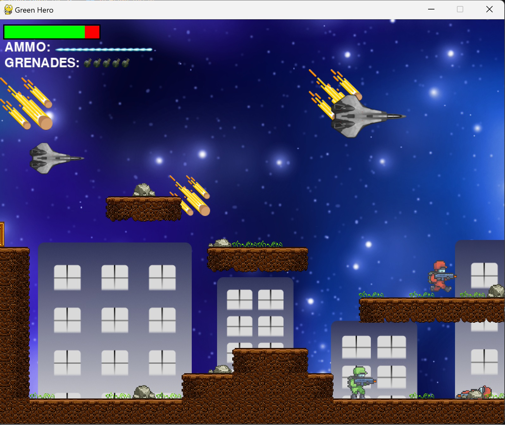

# Green Hero

Welcome to Green Hero, a vibrant and engaging 2D platformer game built with Python and Pygame. Dive into the world of Green-Hero where each level brings its own unique challenges and adventures.

## Table of Contents
- [Features](#features)
- [Installation](#installation)
- [How to Play](#how-to-play)
- [Controls](#controls)
- [Contributing](#contributing)
- [License](#license)
- [Acknowledgments](#acknowledgments)

## Features
- **Multiple Levels**: Explore different levels with enemies, obstacles, and tools.
- **Soundtrack**: Enjoy an audio experience with music that adapts to the gameplay.
- **High Scores**: Compete for the highest score with a saved leaderboard.
- **Customizable Controls**: Personalize your gameplay with configurable keybindings.

## Installation

To run Green-Hero, you'll need to have Python and Pygame installed.

1. Clone the repository:
git clone https://github.com/rakoahmed/green-hero.git

2. Navigate to the game's directory:
cd green-hero

3. Install the requirements (if any):
pip install -r requirements.txt

## How to Play

To start the game, run the `main_game.py` file:

type in `python main_game.py` in the terminal OR Press the play (run) button in the code editor (i.e., VS Code)

The game will launch in a new window, and you can begin your adventure with Green-Hero!

## Menu

## Controls

- **W Key**: Green-Hero jumps.
- **D Key**: Green-Hero moves forward.
- **A Key**: Green-Hero moves backward.
- **Q Key**: Green-Hero Throws grenade.
- **Spacebar**: Green-Hero shoots.

## Contributing

Contributions to Green-Hero are welcome! 

## License

Green-Hero is released under the [MIT License](LICENSE). See the `LICENSE` file for more details.

## Acknowledgments

- Special thanks to the Pygame community for their invaluable resources.

